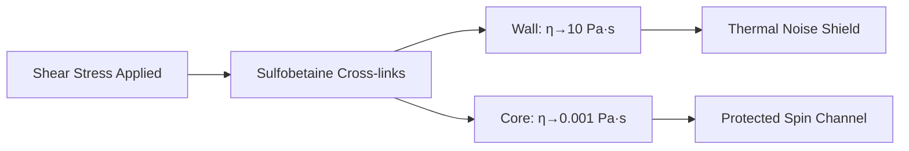

# QNFO Experimental Protocols Whitepaper
## Engineering Specifications for Eras 1-3 | QNFO 100-Year Cascade

**Date:** 2026-07-15 | **Authors:** QNFO Research / QWAV | **Version:** 1.0

---

## ERA 1: FCI MATERIAL ENGINEERING REQUIREMENTS (2026-2036)

> ⚠️ **NOTE:** The foundational QNFO paper (`reassessing-the-foundations-of-quantum-computation` §1.2) identifies FCI as FAILING at nonzero temperature due to thermal anyon proliferation. The paper's proposed solution is ultrametric encoding, NOT FCI. FCI specs below are documented for completeness but are internally contradicted. See `EVIDENCE_SYNTHESIS.md` §2 for full analysis.

### 1.1 Fractional Chern Insulator Substrate Specification

| Parameter | Target | Current State (2026) | Gap |
|:----------|:-------|:---------------------|:-----|
| Anyon type | Non-Abelian (Ising or Fibonacci) | Abelian only confirmed | **Critical — unconfirmed** |
| Operating temperature | ≥4 K | <50 mK for Hall states | **10³× gap** |
| Coherence time (anyon braiding) | >1 ms | <1 μs at best | **10³× gap** |
| Gate fidelity (braiding) | >99.9% | Not measured for anyons | **No data** |
| Fabrication method | Twisted bilayer Moiré heterostructure | Laboratory-scale only | **Scalability unproven** |

### 1.2 Falsification Test
If ν=5/2 FQH state fails to demonstrate non-Abelian braiding statistics in ≥3 independent labs by 2031 → E1 PESSIMISTIC.

### 1.3 Ultrametric Qudit Architecture

Per `ultrametric-quantum` §2.3: tree topology threshold p_th ≈ 2.0×10⁻⁴ is 55× worse than surface code for independent errors. Engineering mitigation:

| Mitigation | Impact |
|:-----------|:-------|
| 3D-integrated 7-ary tree of depth 3 | Manufacturable with current fabrication |
| On-chip prime-frequency resonators | Spectral engineering of error confinement |
| Hybrid tree-grid topology | Leverage tree for correlated errors, grid for independent |

---

## ERA 2: VISCOELASTIC GATING MATRIX PROTOCOLS (2036-2046)

### 2.1 Zwitterionic Hydrogel Synthesis

**Core mechanism:** Sulfobetaine zwitterions form reversible cross-links under shear stress, creating shear-thickening walls that enclose low-viscosity protected channels.

**Protocol (from `_26196003527.md`):**

```
[POLYMERIZATION] Sulfobetaine methacrylate (SBMA) + acrylamide → 
    Free radical polymerization under UV (365 nm, I=10 mW/cm², 30 min) →
    Zwitterionic hydrogel network with pendant sulfobetaine groups

[SPIN-BEARING DOPANT] Embed TEMPO (2,2,6,6-tetramethylpiperidine-1-oxyl) 
    or trityl radical (OX063) at 1-5 mM concentration → 
    Paramagnetic probe with known hyperfine coupling constant

[VISCOELASTIC TUNING] Cross-linker density (MBA, 0.1-5 mol%) →
    Controls sol-gel transition threshold →
    Target: η_local(r) gradient from 10.0 Pa·s (wall) to 0.001 Pa·s (core)
```

### 2.2 Viscoelastic Decoupling Rate

$$\Gamma_{\text{dephase}}(r) = \frac{k_B T}{6 \pi \eta_{\text{local}}(r) a^3} \cdot \left[ 1 - \chi_{\text{top}}(\omega) \right]$$

| Parameter | Symbol | Target Value | Unit |
|:----------|:-------|:-------------|:-----|
| Local viscosity (channel core) | η_local(core) | 0.001 | Pa·s |
| Local viscosity (shear wall) | η_local(wall) | 10.0 | Pa·s |
| Effective spin radius | a | 5.0 | Å |
| Topological protection factor | χ_top(ω) | >0.90 | — |
| Target T₂ at 310K | — | >1 second | **Unverified** |

### 2.3 NMR Tracking Protocol

| Step | Instrument | Measurement |
|:-----|:-----------|:------------|
| S1 | 600 MHz NMR | ¹H T₁ and T₂ relaxation times |
| S2 | EPR (X-band) | Electron spin dephasing rate |
| S3 | Dynamic mechanical analysis | η(ω) frequency sweep |
| S4 | Fluorescence correlation spectroscopy | Local viscosity mapping |

### 2.4 Sol-Gel Transition Engineering



### 2.5 Falsification Test
If reducing local fluid viscosity in engineered channels accelerates rather than decelerates spin dephasing → E2 PESSIMISTIC. **Test has not been performed.**

---

## ERA 3: HYDRODYNAMIC SIMULATION ARCHITECTURE (2046-2076) [SPECULATIVE]

> ⚠️ **No derivation of Bell-violation-compatible local hydrodynamics exists.** Protocols below are theoretical architecture proposals. The Measurement Independence loophole (documented in `PHASE_0_MVP_REPORT.md` T0.3) provides logical possibility but no empirical test. See `EVIDENCE_SYNTHESIS.md` §5.

### 3.1 Madelung Transform Numerical Implementation

| Component | Implementation | Notes |
|:----------|:---------------|:------|
| Wavefunction → Fluid | ρ = |ψ|², v = (ℏ/m)∇(arg ψ) | Standard Madelung 1927 |
| Quantum potential | Q = −(ℏ²/2m)(∇²√ρ/√ρ) | Interpreted as stress tensor |
| Continuity equation | ∂tρ + ∇·(ρv) = 0 | Exact equivalence maintained |
| Momentum equation | ∂t v + (v·∇)v = −(1/m)∇(V + Q) | Classical transport form |

### 3.2 Bell-Test Simulation

| Component | Method | Verification Target |
|:----------|:-------|:-------------------|
| Two-particle entangled state | 4D fluid with Compton-scale coupling | Reproduce CHSH ≥ 2.828 |
| Measurement simulation | Angular projection onto detectors | Match QM statistics ±1% |
| Correlation computation | Time-averaged fluid velocity cross-correlation | Match Bell-test results |

### 3.3 Hardware Requirements

| Component | Spec |
|:----------|:-----|
| Sub-femtosecond tracking | Attosecond laser pump-probe (required for wavefunction visualization) |
| Computational fluid dynamics | >10¹⁸ FLOP/s for full 4D simulation |
| Quantum memory | Cryogenic or room-temperature (E2-dependent) for Bell-test state preparation |

### 3.4 Falsification Test
If sub-femtosecond electron tracking captures a particle changing state instantaneously without local field transport → E3 PESSIMISTIC. **Test requires attosecond laser infrastructure not yet deployed for this purpose.**

---

## ERA 4: PRE-GEOMETRIC MATHEMATICAL FRAMEWORK (2076-2126+) [SPECULATIVE]

> ⚠️ **SPECULATIVE:** All Era 4 items below are theoretical research directions, not engineering specifications. No derivation of any fundamental constant from π and φ exists. See `EVIDENCE_SYNTHESIS.md` §6 for limitations.

### 4.1 S¹ Manifold Topology

| Primitive | Mathematical Form | Physical Interpretation |
|:----------|:------------------|:----------------------|
| Aperiodic log-spiral | r(θ) = r₀ × φ^(θ/π) | Generative pattern for all physical structure |
| Winding numbers | w ∈ ℤ on S¹ | Particle quantum numbers |
| Cross-ratio invariant | α = (r₀, λ_C; 0, ∞) | Fine-structure constant |
| Scale-invariant measure | μ on Berkovich space | Pre-geometric probability measure |

### 4.2 Constants Derivation Target

| Constant | Current Value | Target from Geometry | Status |
|:---------|:--------------|:---------------------|:-------|
| α⁻¹ | 137.035999084(21) | Derivable from π, φ | **No derivation exists** |
| m_e/m_p | 1/1836.15267343(11) | Derivable from winding numbers | **No derivation exists** |
| sin²θ_W | 0.23121(4) | Derivable from topological invariants | **No derivation exists** |

### 4.3 Falsification Test
If empirical constants fluctuate independently or fail to converge on geometric ratios as measurement precision increases → E4 PESSIMISTIC. **Test window: decades to centuries.**

---

## CROSS-ERA INTEGRATION REQUIREMENTS

| Interface | From Era | To Era | Requirement |
|:----------|:---------|:-------|:------------|
| Ultrametric qudit → FCI | E1 | E1 | 3D-integrated tree topology compatible with Moiré heterostructure fabrication |
| Room-temp spin memory → Fluid computer | E2 | E3 | Viscoelastic channels integrate with microfluidic computational architecture |
| Compton-frequency clock | E3 | E4 | Helical ZBW structure links hydrodynamic fluid to S¹ winding numbers |

---

*Protocols derived from `_26196003527.md` (07/15 Obsidian source), ultrametric-quantum §2, paper-physics-of-computation §2-3, and Phase 0 MVP Kapitza calculation.*
*Note: All Era 2-4 protocols are theoretical engineering specifications. No experimental data yet exists for protocols marked "Unverified."*
