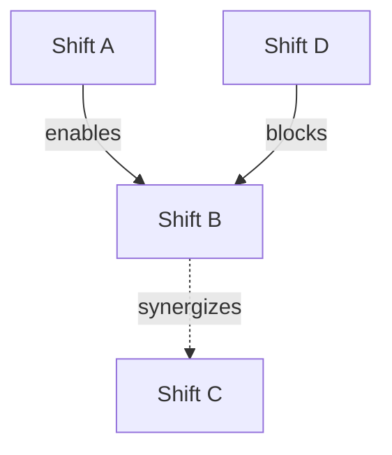

> **Related:** research-planner, literature-search, citation-manager, knowledge-graph, prompt-audit, red-team-dod, memory-management, publication-publisher, github-manager

> **INCLUDES AUTONOMOUS RED-TEAM SELF-AUDIT.** Before claiming this skill complete, autonomously run: (1) Output Verification — negative verification. (2) Assumption Challenge — state and test every assumption. (3) Edge Case Check — empty/null/max/boundary/desync. (4) Iteration — retry on failure, max 3. ANTI-PATTERN: User should NEVER ask about quality.

---

## execute_plan (MANDATORY — Before Any Execution)

Populate update_plan with workflow phases as concrete checklist items. Every item must be short, specific, and testable with tool evidence.

### Execution Protocol
1. Populate update_plan with all 9 stages as checklist items
2. Execute one item at a time — at most ONE in_progress
3. Mark items completed ONLY with tool evidence
4. Never claim completion without execution evidence
5. If blocked: flag [BLOCKED: reason] and move to the next item

---

## Differentiation from research-planner

| Aspect | research-planner | deep-research |
|:-------|:-----------------|:--------------|
| **Starting point** | Seed idea → deconstruct assumptions | Research domain → forecast paradigm shifts |
| **Direction** | Bottom-up (one seed, many consequences) | Top-down (the whole field, ranked futures) |
| **Core operation** | Assumption deconstruction | Impact forecasting + Bayesian optimization |
| **Time frame** | Immediate to near-term | 10 / 20 / 50 / 100+ year horizons |
| **Output** | Single research program | Ranked portfolio of paradigm-shift candidates |
| **Mathematical core** | Qualitative deconstruction table | Bayesian cascading dependency model |
| **Iteration method** | Self-critique (Stage 8) | Red-team adversarial questioning (every stage) |
| **Best for** | "I have an idea, help me develop it" | "What research will matter most in X years?" |

**Do NOT use deep-research when:** the user has a single seed idea they want deconstructed (→ research-planner), needs literature search (→ literature-search), or wants citations formatted (→ citation-manager).

**Expert elicitation alternative:** For rapid directional decisions, polling 5 domain experts produces results orders of magnitude faster than this pipeline. Use deep-research when you need auditable methodology — every assumption is documented, every dependency is explicit, and every probability can be challenged and refined. The value is not the forecast itself but the transparency of the reasoning chain.

---

# Paradigm Forecasting Pipeline v1.1

A top-down, probability-weighted methodology for identifying, ranking, and optimizing research directions most likely to produce paradigm shifts across multiple time horizons.

---

## Stage 0: Domain Scoping & Prior Calibration

**Define the domain boundary.** What counts as "in-scope" for this forecast? Is it a single field (e.g., condensed matter physics), a cross-domain intersection (e.g., AI + neuroscience), or a meta-domain (e.g., "fundamental physics")?

### Domain Characterization
1. **Current consensus map:** What does the field agree on today? What are the settled questions?
2. **Active tensions:** Where are the open disputes, replication crises, unexplained anomalies?
3. **Rate-of-change estimate:** How fast is the field moving? (Accelerating / steady / declining)
4. **Funding/institutional landscape:** Who funds it? What are the incentive structures?
5. **Tool/platform readiness:** What new instruments, datasets, or platforms are arriving in 1-5 years?

### Prior Calibration
- What does historical precedent suggest about paradigm shifts in this domain? Name 2-3 past shifts and their timelines from anomaly → crisis → new paradigm (Kuhnian framework).
- **Base-rate calibration:** Across all scientific domains, how many genuine paradigm shifts occur per decade? Use this as the prior probability for any single forecast. [LLM-INFERRED — historical base rate ~0.5-2 per decade across all science]
- **Reference class anchoring (MANDATORY):** Find 2-3 specific historical forecasts or paradigm-shift predictions that were made in this or an analogous domain. What was predicted? What actually happened? Use the base rate from this reference class to calibrate the prior for every candidate. If every candidate's prior exceeds the reference class base rate by 3×, flag [PRIOR-WARNING: exceeds calibrated reference class]. All reference class examples must carry [WEB-SEARCH] source labels.

**Output:** Domain scope document + prior probability baseline.

**Digest:** 1-sentence domain characterization + base-rate prior.

---

## Stage 1: Finding Synthesis — What the Field Actually Knows

**This is the most empirically grounded stage.** Before any forecasting, synthesize what the domain's most significant findings actually are. Do NOT forecast yet — just map the landscape.

### Synthesis Protocol
1. **Semantic Scholar / arXiv sweep:** Search for the 20-50 most-cited or most-discussed papers from the last 5 years. [LLM-executable via: web search + Semantic Scholar API]
2. **Knowledge-graph cross-reference:** Query QNFO knowledge graph for existing domain nodes and their relationships. [LLM-executable via: `query_graph`]
3. **Gap taxonomy:** Classify findings into:
   - **Confirmed results** (replicated, uncontroversial)
   - **Promising but unreplicated** (high-profile, single-lab results)
   - **Anomalies** (data that doesn't fit the consensus model)
   - **Theoretical tensions** (competing frameworks that can't both be right)
4. **Impact ranking:** Rank findings by: (a) citation velocity, (b) downstream consequence breadth, (c) anomaly-generating potential

**Output:** Synthesized landscape document with ranked findings and gap taxonomy.

**Digest:** Top-3 most significant findings + the single most pregnant anomaly.

---

## Stage 2: Paradigm-Shift Candidate Generation

For each time horizon, generate paradigm-shift candidates. Each candidate must specify: **what changes**, **what causes the change**, and **what the world looks like after**.

### Time-Horizon Framework

| Horizon | Character | What Drives It | Candidate Count |
|:--------|:----------|:---------------|:----------------|
| **10 years** | Incremental-to-disruptive within current frameworks | New instruments, datasets, computational capacity | 5-8 candidates |
| **20 years** | Framework-level shifts; anomalies accumulate past denial threshold | Accumulated anomaly pressure, generational turnover | 4-6 candidates |
| **50 years** | Genuine paradigm shifts; old frameworks abandoned | Conceptual revolutions, cross-domain fusion | 3-5 candidates |
| **100+ years** | Civilizational reconfigurations of knowledge | Unpredictable — probabilistic boundary estimate | 2-3 candidates |

### Candidate Structure
Each candidate must have:
- **Name:** Short descriptive label
- **Trigger anomaly:** What specific current finding/anomaly is the seed?
- **Shift description:** What changes? What replaces what?
- **Signposts:** What would we see in 5, 10, 20 years if this is real?
- **Falsification condition:** What observation would kill this candidate?

### Continuity Baseline (MANDATORY)
**Before generating paradigm-shift candidates, define the "Incremental Progress" baseline.** This is the null hypothesis: no paradigm shift occurs in this domain over the forecast window. Instead, the field advances through normal incremental accumulation. Assign this baseline a prior probability using the reference class base rate from Stage 0 (typically P(continuity) ≈ 0.90–0.95 for any single decade). Every paradigm-shift candidate must compete against this baseline — if the cumulative probability of all paradigm-shift candidates exceeds P(continuity), flag [BASE-RATE-NEGLECT: sum of revolution priors exceeds historical base rate of continuity].

**Output:** Ranked list of paradigm-shift candidates per time horizon, each with full structure. Include the Continuity Baseline as candidate #0.

**Digest:** Candidate count per horizon + the "most likely to be right" and "most impactful if right" candidates.

---

## Stage 3: Assumption Audit & Counterfactual Analysis

For each paradigm-shift candidate from Stage 2, perform a rigorous assumption audit.

### Assumption Audit Protocol
For each candidate, list:
1. **Enabling assumptions:** What must be true about the world for this shift to occur?
2. **Blocking assumptions:** What currently-true things must become false?
3. **Dependency chain:** Which other shifts must happen first?
4. **Confidence calibration per assumption:** Tag each as [HIGH], [MEDIUM], [LOW] confidence.

### Counterfactual Generation
For each candidate, generate:
1. **Null counterfactual:** "This shift doesn't happen — what do we observe instead?"
2. **Alternative counterfactual:** "A different shift explains the same anomalies — what is it?"
3. **Inversion:** "The opposite of this shift is actually what happens."

### Falsification Criteria
Every candidate must have at least one **specific, observable, time-bound** falsification test:
- "If [candidate] is wrong, then by [year] we should observe [observation]."
- Falsification tests must be checkable by LLM via web search / API / code execution.

**Output:** Assumption matrix + counterfactual tree + falsification register per candidate.

**Digest:** Most fragile assumption across all candidates + strongest counterfactual alternative.

---

## Stage 4: Adversarial Red-Team Iteration

Run each candidate through adversarial questioning. This is NOT a pro-forma step — genuinely try to destroy each candidate.

### Red-Team Protocol
For each candidate, role-play the following adversaries:

1. **The rigorous empiricist:** "Where is the evidence? What experiment has actually been done?"
2. **The Kuhnian conservative:** "Anomalies are always resolvable within the current paradigm. Why is this different?"
3. **The Bayesian skeptic:** "Given the base rate of paradigm shifts, the prior probability of any specific shift is tiny. What evidence would overcome this prior?"
4. **The institutional realist:** "Even if true, the sociology of science — funding, tenure, prestige — will prevent adoption for decades. How do you overcome this?"
5. **The alternative explainer:** "Here is a simpler explanation for the same anomalies that requires no paradigm shift: [generate specific alternative]."

### Kill/Wound/Survive Assessment
After red-team, classify each candidate:
- **KILLED:** Falsified by existing evidence or logically incoherent
- **WOUNDED:** Major assumption shown to be fragile; probability reduced by >50%
- **SURVIVED:** Withstands red-team with no fatal wounds

**Iterate:** Wounded candidates get one revision round. Apply the fix, re-red-team. Max 2 iterations.

**Output:** Red-team transcripts + kill/wound/survive classification + revised probabilities.

**Digest:** Survivor count + most devastating red-team question asked.

---

## Stage 5: Bayesian Cascading Dependency Model

Build a probability-weighted impact model with cascading dependencies. This is the mathematical core of the methodology.

### Model Architecture

See `scripts/impact_matrix.py` for the executable model. The model computes:

1. **Prior probability P(shift_i):** Derived from Stage 3 assumption confidence calibration + Stage 4 red-team adjustment
2. **Conditional dependencies P(shift_i | shift_j):** Which shifts enable or block which others?
3. **Impact factor I(shift_i):** Multi-dimensional impact score (scientific × technological × societal × economic)
4. **Time-horizon weighting w(t):** Nearer shifts weighted higher (time-value of knowledge)
5. **Expected value EV(shift_i):** P(shift_i) × I(shift_i) × Σ[P(dep_k | shift_i) × I(dep_k) × w(t_k)]

### Dependency Structure
Define a directed acyclic graph (DAG) of dependencies:
- **Enables (→):** shift_i must happen before shift_j
- **Blocks (⊘):** shift_i makes shift_j impossible
- **Synergizes (⇄):** shifts amplify each other's impact

**After constructing the DAG, render it as a Mermaid diagram.** Use `graph TD` for top-down layout, labeling each edge with its type. This makes the dependency structure visually auditable. Example:


### Portfolio Optimization
Given the DAG structure, compute the **Pareto-optimal research portfolio**: which set of research directions maximizes total expected value under budget/resource constraints?

```
Maximize: Σ EV(shift_i) × x_i
Subject to: x_i ∈ {0,1}, Σ resource_cost_i × x_i ≤ budget
Where: x_i = 1 means "invest in shift_i"
```

### Sensitivity Analysis
- Vary each prior probability by ±20% and recompute portfolio
- **Halve-all-priors check (MANDATORY):** Multiply all candidate priors by 0.50 and recompute the optimal portfolio. If the selected candidates change, flag [PRIOR-SENSITIVE: portfolio depends on subjective probability estimates — consider expert elicitation to anchor priors]
- Vary impact weights (scientific vs technological vs societal) and recompute
- Test removal of each enabling dependency

### Choke Node Identification
A **choke node** is the specific conditional probability pair that carries the highest leverage over total lifecycle EV. It is typically:
- A pessimistic outcome in an early era that cascades into pessimistic outcomes in all subsequent eras (e.g., P(E2_Pess | E1_Pess) = 0.70)
- Found by: computing the ΔEV of removing each conditional edge in the DAG

### Leverage Node Identification
A **leverage node** is the era where P(E_n_Opt | E_(n-1)_Opt) is very high (>0.80), meaning that era is the "golden key." Investing 40-50% of budget here drags up the entire lifecycle EV.

### Counterfactual Floor
Compute the minimum portfolio EV if the most fragile assumption fails. This is the **anti-fragility floor** — the worst-case EV the strategy guarantees. If the floor is below 50% of optimal EV, flag [FRAGILE: single point of failure].

**Output:** Bayesian DAG, EV table, Pareto-optimal portfolio, sensitivity tornado chart, choke/leverage node register, anti-fragility floor.

**Digest:** Top EV candidate + choke node + leverage node + anti-fragility floor.

---

## Stage 6: Thesis Optimization & Long-Range Synthesis

Synthesize all previous stages into an optimized research thesis and long-range forecast.

### Thesis Generation
For the top-ranked paradigm-shift candidates, generate:
1. **Core thesis:** A single bold, falsifiable sentence
2. **Abstract:** Standard academic format — domain context, key anomaly, proposed shift, method of investigation, significance
3. **Research questions:** 5-8, tagged with time horizon and executor [LLM] / [Human+LLM]
4. **Signposts timeline:** What observable milestones would confirm or refute at 5/10/20/50 years?

### Long-Range Synthesis Narrative
Write a coherent narrative connecting the top-3 surviving candidates across time horizons:
- **10 years:** What the field looks like if the top near-term candidate pans out
- **20 years:** How the 10-year shift cascades into the 20-year candidate
- **50 years:** The field post-paradigm-shift — what questions become askable?
- **100+ years:** Speculative boundary — what becomes thinkable?

### Alternative Futures (Scenario Planning)
Generate 3 distinct scenario trees:
1. **Optimistic:** All top candidates succeed; cascade effects compound
2. **Pessimistic:** Key dependencies fail; field stagnates or retreats
3. **Wildcard:** A currently-unpredicted shift upends everything (specify what observable anomaly could trigger this)

### Counterfactual Pivot (Anti-Fragility)
For the choke node identified in Stage 5, design a **concrete fallback plan**:
- If the choke node's pessimistic scenario materializes, what is the immediate operational pivot?
- The pivot must preserve the leverage node's conditional probabilities (i.e., keep P(E_n | E_(n-1)) from collapsing)
- Example: "If Era 1 hits Pessimistic (15% chance), shift 70% of Era 2 budget to solid-state fallback (NV-diamond). This preserves the Era 2→Era 3 link, ensuring total EV floor never drops below [threshold]."

### Final Optimization
Re-run the Bayesian model with thesis refinement + counterfactual pivot included. The goal: maximize P(acceptance) × Impact **and** raise the anti-fragility floor.

**Output:** Optimized thesis + abstract + research questions + scenario trees + signposts timeline + counterfactual pivot plan.

**Digest:** Optimized thesis statement + top-3 research questions + counterfactual pivot trigger.

---

## Stage 7: LLM-Executable Research Roadmap

Convert the optimized thesis into an immediately executable research program.

### Roadmap Structure
- **Phase 0 (Immediate, LLM-only):** What can be simulated, computed, or searched right now?
- **Phase 1 (3-6 months):** Literature synthesis, computational experiments, dataset construction
- **Phase 2 (1-3 years):** If human collaborators available, what experiments/studies?
- **Phase 3 (3-10 years):** Institutional/field-level changes needed

### Resource Allocation Rules (CFPE Doctrine)
Apply these strategic rules derived from the Bayesian cascade model:

1. **Leverage Node Rule:** If P(Era_n_Opt | Era_(n-1)_Opt) > 0.80, allocate 40–50% of budget to Era_(n-1) — even if Era 1 is technically first. Build Era_(n-1) in parallel to avoid waiting.
2. **Choke Node Rule:** The era with the highest P(Pessimistic) is your governance/institutional bottleneck. Engineering alone won't fix it — add adoption incentives, regulatory mandates, or demonstration missions.
3. **Red-Team Hardening Loop:** If the Optimistic probability of the final era is below 0.30, return to Stage 4 and introduce a technical countermeasure that physically prevents the Pessimistic scenario.

### Deliverable Bundles
For each phase, specify:
- What gets produced (paper, dataset, simulation, proof-of-concept)
- What tools/APIs/infrastructure are needed
- What constitutes "done" (go/no-go criteria)

**Output:** Phased roadmap with deliverables, tools, go/no-go gates, and resource allocation map.

**Digest:** Phase 0 immediate executable tasks + go/no-go criteria + top-level resource allocation percentages.

---

## Stage 8: Self-Critique & Blind-Spot Analysis

**"What This Forecast Likely Misses (And When To Ignore It)"**

1. **Unknown unknowns:** What category of discovery (entirely new phenomena, not predicted by any candidate) would invalidate this whole forecast?
2. **Institutional inertia constraint:** Is the model underestimating how long paradigm shifts take due to sociological factors? (Historical median: 20-30 years from anomaly recognition to paradigm acceptance.)
3. **Funding distortion:** How do current funding priorities bias which candidate seems most likely?
4. **LLM knowledge cutoff bias:** What post-training developments could change the landscape?
5. **When to ignore this critique:** Under what conditions is the forecast robust despite these blind spots?

**Output:** Blind-spot register with severity ratings [CRITICAL / SIGNIFICANT / MINOR].

**Digest:** Most severe blind spot + mitigation recommendation.

---

## Stage 9: Calibration Register & Back-Testing Protocol

**Bayesian models are only as good as their calibration.** Without tracking predictions against reality, the entire pipeline is unfalsifiable. This stage creates an auditable prediction register.

### Prediction Register
For every candidate with P(shift) > 0.10, record:
- **Candidate ID and name**
- **Probability estimate (date-stamped)**
- **Falsification test from Stage 3** (specific, observable, time-bound)
- **Earliest check date:** When will the first evidence arrive?
- **Confidence interval:** ±X% around the point estimate

### Back-Testing Cadence
Define when this forecast should be revisited:
- **6-month check:** Any new preprints or preliminary results?
- **1-year check:** Has the falsification test been attempted? Partial results?
- **2-year check:** Has evidence shifted any probability by >20%? If yes, note the calibration error.
- **5-year check:** How many of the predictions from this forecast were directionally correct?

### Calibration Score
At each check, compute: `calibration_error = |predicted_P - observed_frequency|`. When a candidate's falsification test window closes, classify it as:
- **HIT:** The predicted shift occurred within the forecast window
- **MISS:** The falsification condition was met and the candidate is refuted
- **INCONCLUSIVE:** The test window closed without decisive evidence

### Anti-Pattern Prevention
**Do NOT skip this stage on the grounds that "the forecast is speculative."** The purpose of a prediction register is precisely to discipline speculation — to make it accountable to future evidence. A forecast without a register is unfalsifiable storytelling.

**Output:** Prediction register with date-stamped probabilities, falsification tests, check cadence, and calibration score template.

**Digest:** Number of registered predictions + earliest check date.

---

## Reference Files

- **Bayesian model details:** See `references/bayesian-model.md` for the full mathematical specification, DAG construction rules, and portfolio optimization algorithm.
- **Failure modes and remedies:** See `references/failure-modes.md` for known anti-patterns at each stage and how to recover.
- **Output template:** See `references/output-template.md` for a reusable markdown template for the final forecast report.
- **Worked example (QNFO 100-year roadmap):** See `references/worked-example-qnfo.md` for a complete demonstration of the methodology applied to a real research program across 4 eras (cryogenic quantum → bio-spintronics → hydrodynamic foundations → pre-geometric physics). Includes red-team audits, Bayesian cascade matrices, and counterfactual pivots.

## Scripts

- **`scripts/impact_matrix.py`:** Executable Bayesian cascading dependency model. Computes prior probabilities, conditional dependencies, expected values, and Pareto-optimal portfolios. Run with `python impact_matrix.py --input candidates.json`.

---

## Quick Mode

Add `--quick` to run a compressed version: skip Stages 3-4, use heuristic priors, no full DAG. ~3K tokens. MANDATORY: still run the Continuity Baseline and Reference Class Anchoring.

### Quick Mode Pipeline
- **Stage 0 (condensed):** 1-paragraph domain characterization + reference class base rate
- **Stage 1 (condensed):** Top-5 findings + dominant anomaly (1 paragraph each, ~500 words total)
- **Stage 2 (condensed):** 3 candidates per horizon (heuristic selection) + Continuity Baseline
- **Stage 5 (condensed):** Simple EV matrix (heuristic priors, no DAG, flat dependencies, no conditional cascades)
- **Stage 6 (condensed):** Single thesis + top-3 research questions + counterfactual pivot
- **Stages 3, 4, 7, 8, 9:** SKIPPED in quick mode

## Executive Mode

Add `--executive` to produce a decision-maker-ready summary alongside the full report. Output: (a) 1-page executive summary with top-3 findings, optimal portfolio, and anti-fragility floor; (b) Mermaid decision tree showing the recommended resource allocation; (c) 3 concrete recommendations with costs and go/no-go criteria. The full academic output remains available but the executive summary is the primary deliverable. Use this when the audience is funding bodies, institutional decision-makers, or non-specialist stakeholders.

## Activation

```
Forecast: <domain> [--quick] [--executive] [--horizons 10,20,50] [--mode LLM-Only|Hybrid]
```

Examples:
- `Forecast: quantum computing paradigm shifts --quick` → Quick mode, heuristic EV matrix
- `Forecast: fundamental physics, next 50 years` → Full 9-stage, physics domain, default horizons
- `Forecast: AI alignment research impact --horizons 10,20` → Only near-term horizons
- `Forecast: climate tech adoption --executive` → Full pipeline + decision-maker executive summary

---

## Cross-Skill Integration Map

deep-research consumes and feeds multiple QNFO skills. This section documents every bidirectional integration.

### Upstream (Skills That Feed INTO deep-research)

| Skill | Integration Point | Stage | How It Feeds |
|:------|:------------------|:------|:-------------|
| `literature-search` | Stage 1 — Finding Synthesis | Ingest | Provides multi-source paper triage (core/supporting/background) to populate the gap taxonomy |
| `knowledge-graph` | Stage 1 — Cross-reference | Ingest | `query_graph` for existing domain nodes, ultrametric ball queries for related projects, lifecycle status checks |
| `red-team-dod` | Stage 4 — Red-Team Protocol | Methodology | Canonical red-team adversary roles and DoD enforcement. Stage 4 should reference `skill_view('red-team-dod')` for the complete adversary playbook |
| `citation-manager` | Stage 6 — Thesis Generation | Formatting | Validates BibTeX entries, flags missing DOIs, formats reference lists for any publication outputs |

### Downstream (Skills That Consume deep-research Output)

| Skill | Integration Point | Stage | How It Consumes |
|:------|:------------------|:------|:----------------|
| `research-planner` | Post-pipeline | Deep-dive | Takes individual top-ranked paradigm-shift candidates and deconstructs them into executable research programs |
| `literature-search` | Post-pipeline | Gap-filling | Receives the gap analysis from the forecast report and executes targeted literature searches on under-explored areas |
| `citation-manager` | Post-pipeline | Bibliographic | Receives the full reference list from the forecast report for BibTeX formatting and verification |
| `knowledge-graph` | Post-pipeline | Persistence | Seeds new DECISION nodes (one per paradigm-shift candidate), FORECAST nodes (the full report), and EDGE connections to existing project nodes |
| `memory-management` | Stage 9 — Calibration Register | Persistence | Stores prediction register entries as durable `project_fact` memories with scheduled recall at check cadence points (6mo, 1yr, 2yr, 5yr) |
| `publication-publisher` | Post-pipeline | Dissemination | If the forecast is publication-worthy: formats with `pdf-builder`, uploads to Zenodo, deploys to Pages, orchestrates social media |
| `github-manager` | Post-pipeline | Archival | Archives the full forecast report (Markdown + JSON output from `impact_matrix.py`) to the GitHub canonical repository |
| `prompt-audit` | Post-pipeline | Quality Check | Audits the deep-research output against 19 industry design patterns to verify structural integrity of the forecast report |

---

> **Version:** v1.1 — Kaizen-updated 2026-07-15. Changelog: Added Continuity Baseline (Stage 2), Reference Class Anchoring (Stage 0), halve-all-priors sensitivity check (Stage 5), Mermaid DAG rendering (Stage 5), Executive Mode flag, expanded Quick Mode specification, Calibration Register with back-testing protocol (Stage 9), expert elicitation alternative preamble. 7 red-team findings resolved.
